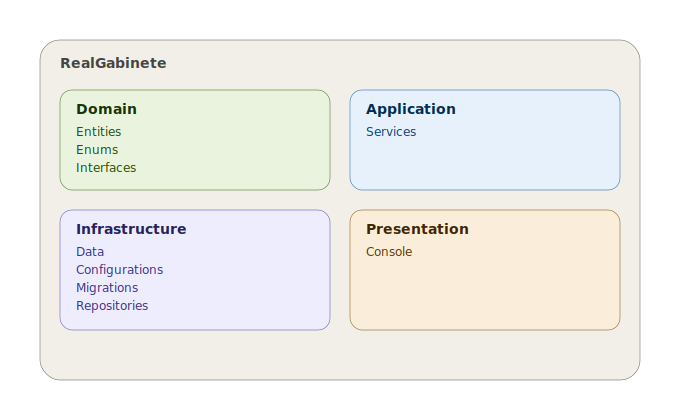

# RealGabinete

Sistema de gestão de biblioteca (livros, exemplares físicos, autores, editoras, categorias, leitores, bibliotecários, empréstimos, reservas e multas).

## Estrutura do repositório

```
RealGabinete/
├── README.md
├── .gitignore
├── Data/
│   ├── SQL/
│   │   └── RealGabinete.sql      -- schema completo da base de dados
│   └── Diagrama_Gabinete.jpg     -- diagrama entidade-relacionamento
└── Back/
    └── RealGabinete/             -- projeto .NET (back-end)
```

## Modelo de dados

O schema em `Data/SQL/RealGabinete.sql` define, entre outras, as seguintes tabelas:

| Tabela | Descrição |
|---|---|
| `Salas` / `Prateleiras` | Localização física dos exemplares |
| `Autores` / `Editoras` / `Categorias` | Metadados dos livros |
| `Livros` | O **título** (obra), identificado por ISBN — não é um objeto físico |
| `Exemplares` | Cada **cópia física** de um Livro, com estado e localização |
| `Leitores` | Utentes da biblioteca |
| `Bibliotecarios` | Funcionários que processam empréstimos, com autenticação |
| `Emprestimos` | Liga um Exemplar a um Leitor e ao Bibliotecário que o processou |
| `Reservas` | Reserva de um Livro (título), não de um exemplar específico |
| `Multas` | Associadas a um Empréstimo (ex: atraso na devolução) |
| `Historico_Emprestimos` (view) | Consulta de empréstimos já concluídos, sem duplicar dados |

Ver o diagrama em `Data/Diagrama_Gabinete.jpg` para a visão completa das relações.

### Decisões de modelação mais importantes

1. **Livro ≠ Exemplar.** `Livros` representa a obra (ISBN único); `Exemplares` representa cada cópia física, com o seu próprio estado (`Disponivel`, `Emprestado`, `Reservado`, `Danificado`, `Perdido`) e localização (`Sala` → `Prateleira`).
2. **`Emprestimos` liga-se a `Exemplar_Id`**, não a `Livro_Id` — é sempre uma cópia concreta que sai da biblioteca. Regista também qual `Bibliotecario` processou o empréstimo.
3. **Índice único filtrado** garante que um exemplar nunca tem dois empréstimos ativos em simultâneo.
4. **`CHECK` constraints** validam estados, status de reservas e datas diretamente na base de dados.
5. **`Historico_Emprestimos` é uma VIEW**, não uma tabela — evita duplicar dados já existentes noutras tabelas.

## Arquitetura do projeto




